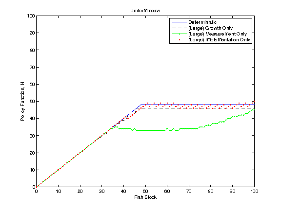
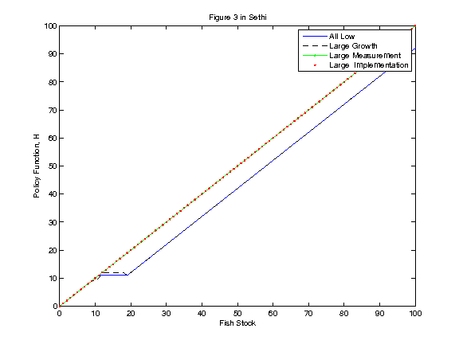

Summary of results from Carl's scripts 
----------------------------------------

- Author: Carl Boettiger, Mike Springborn, Jim Sanchirico
- Date: 2014-04-08


<!-- 

Growth Noise Only
------------------

Run: 

```bash
matlab -nodesktop < testing.m > testing.log

```

Results from running [testing.m](testing.m):

- log normal noise
- sigma_g = 0.2 
- Other noise set to zero.  
- Coarse grid `0:5:150`
- (See linked code all parameters)


measurement Noise only
--------------------------

- Code: [measurement_uncertainty.m](measurement_uncertainty.m)
- `sigma_m = 0.5` 
- Other noise set to zero.  
- Fine grid `0:1:150`
- (See linked code all parameters)


Implementation Noise only
--------------------------

- Code: [implementation_uncertainty.m](implementation_uncertainty.m)
- `sigma_i = 0.5`
- Other noise set to zero.  
- Fine grid `0:1:150`
- (See linked code all parameters)


-->

Attempt to replicate Figure 3, but with one noise at a time
-----------------------------------------------------------

- Code: [one_noise_at_a_time.m](one_noise_at_a_time.m)
- Uniform Noise 
- Large noise means devation of 0.5, as in Sethi
- Other noise terms are 0 instead of 0.1 




Figure 3
---------

- Code: [carl_fig3.m](carl_fig3.m)
- Uniform Noise 
- Large noise means devation of 0.5, as in Sethi
- Small noise means 0.1, as in Sethi




