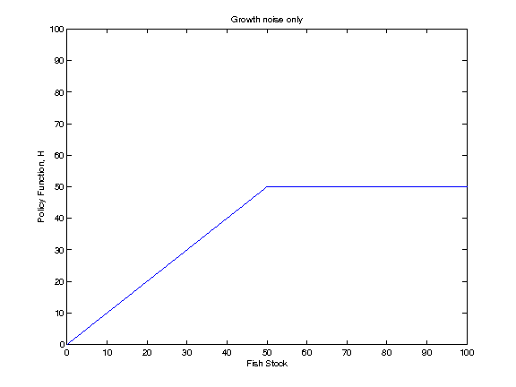
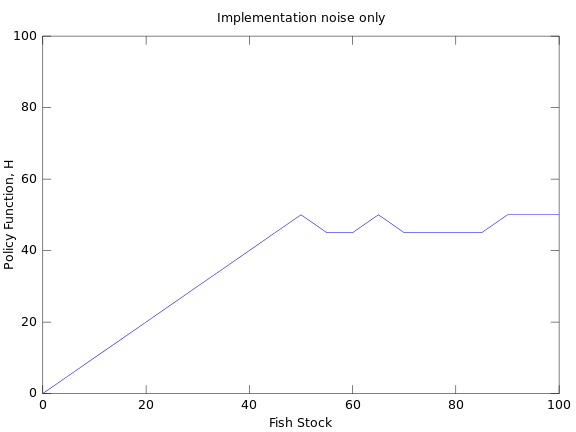
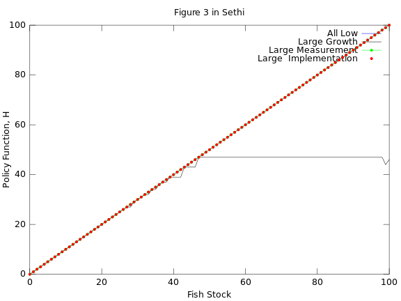

Summary of results from Carl's scripts 
----------------------------------------

- Author: Carl Boettiger, Mike Springborn, Jim Sanchirico
- Date: 2014-04-08


Growth Noise Only
------------------

Run: 

```bash
matlab -nodesktop < testing.m > testing.log

```

Results from running [testing.m](testing.m):

- log normal noise
- sigma_g = 0.2 
- Other noise set to zero.  
- Coarse grid `0:5:150`
- (See linked code all parameters)





Implementation Noise only
--------------------------

- Code: [implementation_uncertainty.m](implementation_uncertainty.m)
- sigma_i = 0.2 
- Other noise set to zero.  
- Coarse grid `0:5:150`
- (See linked code all parameters)





Attempt to replicate Figure 3
-----------------------------

- Code: [carl_fig3.m](carl_fig3.m)
- small: all noise at 0.01
- growth: growth noise at 0.1, all others at 0.01
- measure: meaurement noise at 0.1, others at 0.01
- implement: implementation noise at 0.1, others at 0.01
- All are uniform pdf noise functions 
- Fine grid of `0:1:150`
- see linked code to confirm parameters, etc
- This run from octave, on laptop, batch mode.  


