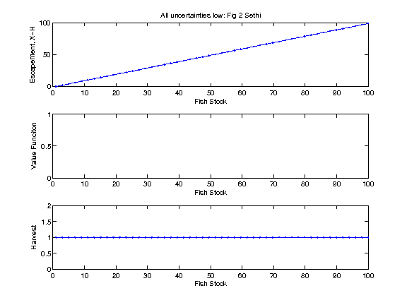

Multiple uncertainty 
--------------------

- Author: Carl Boettiger, Mike Springborn, Jim Sanchirico
- Date: 2014-04-08


Run: 

```bash
matlab -nodesktop < script_mulitpleU.m > script_mulitpleU.log

```

Results from running [script_mulitpleU.m](script_mulitpleU.m)



<!--


-->

