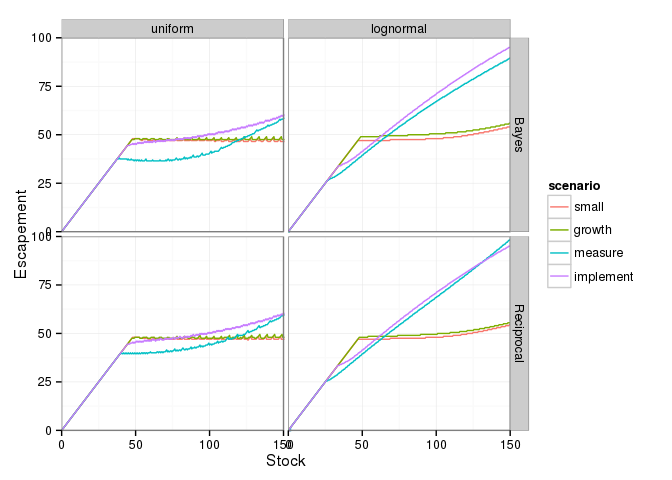
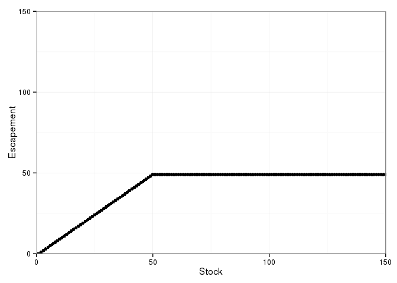

``` r
library("dplyr")
library("tidyr")
library("ggplot2")
library("multipleuncertainty")
```

``` r
fig3 <- function(noise, assume){  
  grid <- seq(0, 200, by=0.5)
  small     <- multiple_uncertainty(f = logistic, x_grid = grid, sigma_g = 0.1, sigma_m = 0.1, sigma_i = 0.1, noise_dist = noise, assume = assume)
  growth    <- multiple_uncertainty(f = logistic, x_grid = grid, sigma_g = 0.5, sigma_m = 0.1, sigma_i = 0.1, noise_dist = noise, assume = assume)
  measure   <- multiple_uncertainty(f = logistic, x_grid = grid, sigma_g = 0.1, sigma_m = 0.5, sigma_i = 0.1, noise_dist = noise, assume = assume)
  implement <- multiple_uncertainty(f = logistic, x_grid = grid, sigma_g = 0.1, sigma_m = 0.1, sigma_i = 0.5, noise_dist = noise, assume = assume)
  df <- data.frame(y_grid = grid, small = small, growth = growth, 
                   measure = measure, implement = implement) %>%
    tidyr::gather(scenario, value, -y_grid)
}

df <- 
  expand.grid(noise = c("uniform", "lognormal"), assume = c("Bayes", "Reciprocal")) %>%
  dplyr::group_by(noise, assume) %>%
  dplyr::do(fig3(.$noise, .$assume))
```

``` r
df %>% ggplot(aes(x = y_grid, y = value, col = scenario)) + 
    geom_line()  + 
    facet_grid(assume ~ noise) + 
    xlab("Stock") + 
    ylab("Escapement") + 
    coord_cartesian(xlim = c(0, 150), ylim = c(0,100)) + 
    theme_bw()
```



Reed Result
-----------

``` r
reed <- multiple_uncertainty(noise_dist = "lognormal")

qplot(seq_along(reed), reed) + 
    coord_cartesian(xlim = c(0, 150), ylim = c(0, 150)) + 
    xlab("Stock") + ylab("Escapement") +
    theme_bw()
```


