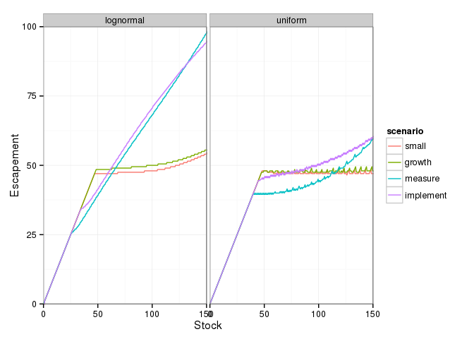
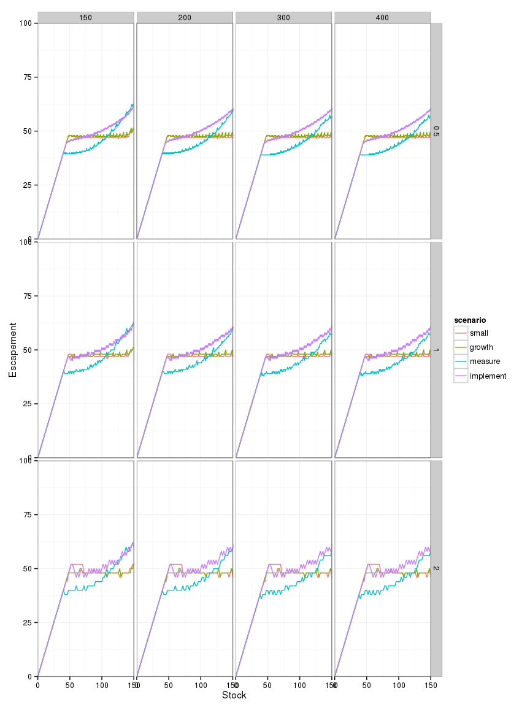
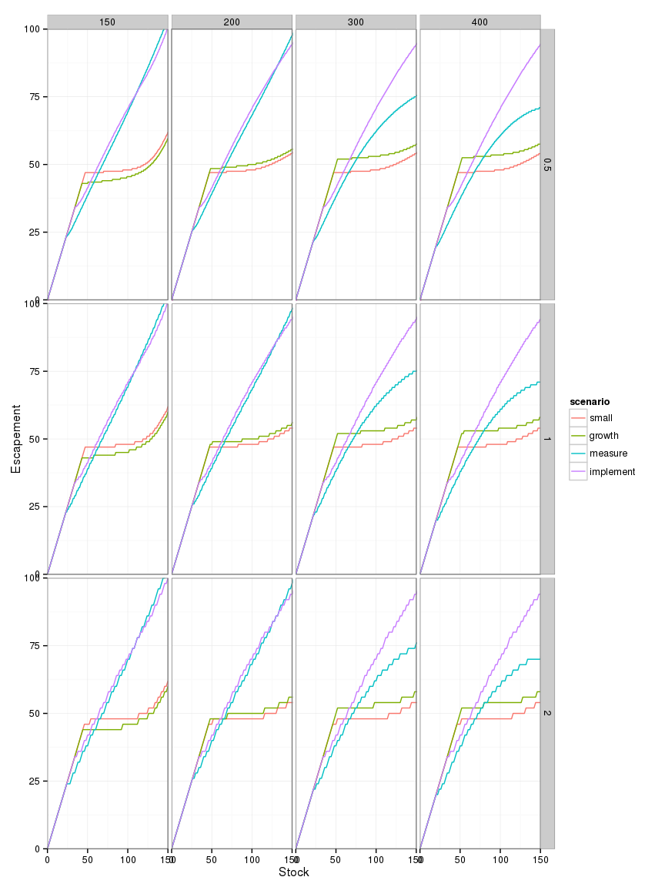
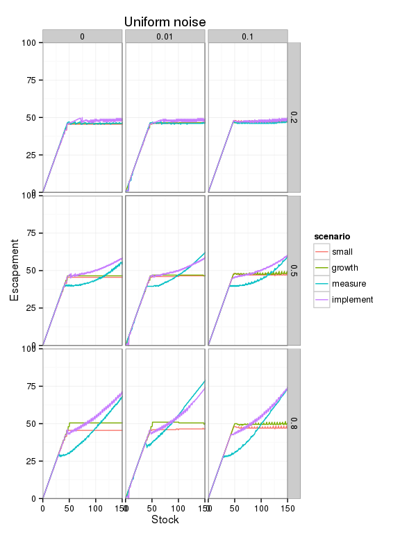
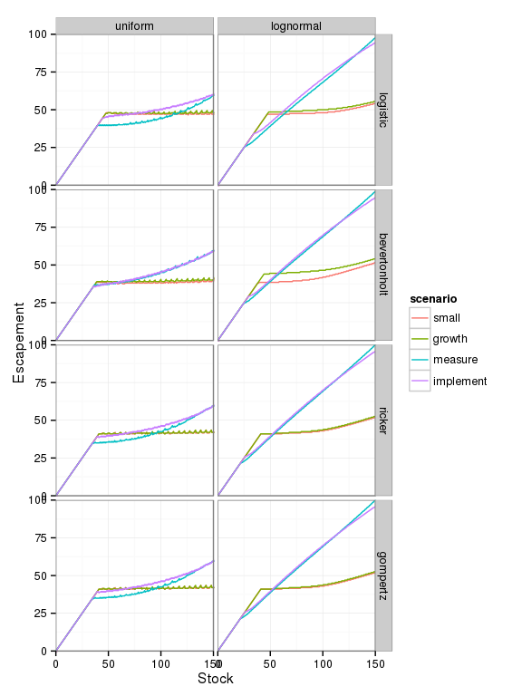
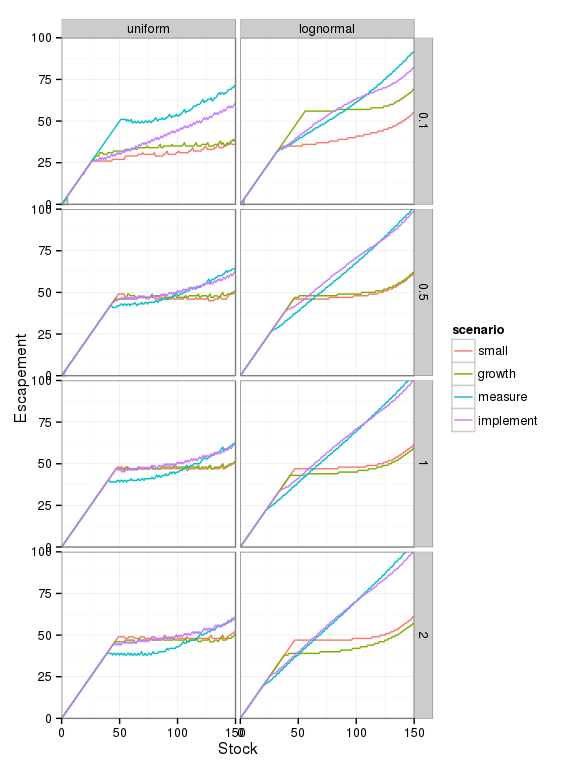
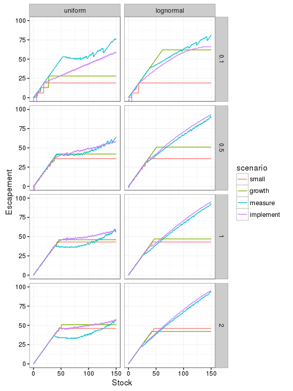
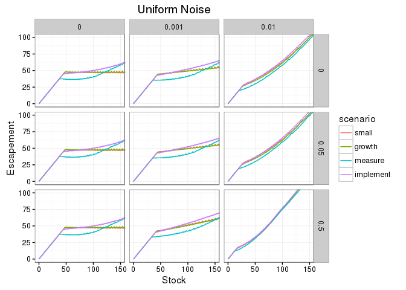

``` r
library("dplyr")
library("tidyr")
library("ggplot2")
library("multipleuncertainty")
library("parallel")
knitr::opts_chunk$set(cache = TRUE)
```

Focal result
------------

``` r
fig3 <- function(noise){  
  grid <- seq(0, 200, by=0.5)
  small     <- multiple_uncertainty(f = logistic, x_grid = grid, sigma_g = 0.1, sigma_m = 0.1, sigma_i = 0.1, noise_dist = noise)
  growth    <- multiple_uncertainty(f = logistic, x_grid = grid, sigma_g = 0.5, sigma_m = 0.1, sigma_i = 0.1, noise_dist = noise)
  measure   <- multiple_uncertainty(f = logistic, x_grid = grid, sigma_g = 0.1, sigma_m = 0.5, sigma_i = 0.1, noise_dist = noise)
  implement <- multiple_uncertainty(f = logistic, x_grid = grid, sigma_g = 0.1, sigma_m = 0.1, sigma_i = 0.5, noise_dist = noise)
  df <- data.frame(y_grid = grid, small = small, growth = growth, 
                   measure = measure, implement = implement) %>%
    tidyr::gather(scenario, value, -y_grid)
}

df <- 
data.frame(noise = c("uniform", "lognormal")) %>%
  dplyr::group_by(noise) %>%
  dplyr::do(fig3(.$noise))
```

``` r
df %>% ggplot(aes(x = y_grid, y = value, col = scenario)) + 
    geom_line()  + 
    facet_wrap(~ noise) + 
    xlab("Stock") + 
    ylab("Escapement") + 
    coord_cartesian(xlim = c(0, 150), ylim = c(0,100)) + 
    theme_bw()
```



------------------------------------------------------------------------

Results are robust to grid
--------------------------

We confirm the general pattern observed is independent of the choice of grid step-size or the grid's maximum range. To do so, we consider all combinations of maximum grid range and grid step size, using possible maximum ranges of `150`, `200`, `300`, and `400`, and possible step sizes of `0.5`, `1`, and `2`. Note that the largest grid thus has 800 grid points and the resulting linear algebra may need 16 GB of memory.

``` r
fig3 <- function(max, by, noise="uniform"){  
  grid <- seq(0, max, by = by)
  small     <- multiple_uncertainty(f = logistic, x_grid = grid, sigma_g = 0.1, sigma_m = 0.1, sigma_i = 0.1, noise_dist = noise)
  growth    <- multiple_uncertainty(f = logistic, x_grid = grid, sigma_g = 0.5, sigma_m = 0.1, sigma_i = 0.1, noise_dist = noise)
  measure   <- multiple_uncertainty(f = logistic, x_grid = grid, sigma_g = 0.1, sigma_m = 0.5, sigma_i = 0.1, noise_dist = noise)
  implement <- multiple_uncertainty(f = logistic, x_grid = grid, sigma_g = 0.1, sigma_m = 0.1, sigma_i = 0.5, noise_dist = noise)
  df <- data.frame(y_grid = grid, small = small, growth = growth, 
                   measure = measure, implement = implement) %>%
    tidyr::gather(scenario, value, -y_grid)
}

df <- 
expand.grid(max = c(150, 200, 300, 400), 
            by = c(0.5, 1, 2)) %>%
  dplyr::group_by(max,by) %>%
  dplyr::do(fig3(.$max, .$by, "uniform"))
```

``` r
plt <- function(df)
  df %>% ggplot(aes(x = y_grid, y = value, col = scenario)) + 
    geom_line()  + 
    facet_grid(by ~ max) + 
    xlab("Stock") + 
    ylab("Escapement") + 
    coord_cartesian(xlim = c(0, 150), ylim = c(0,100)) + 
    theme_bw()

df %>% plt()
```



We can repeat this analysis for lognormal noise, which we find to be even less sensitive to the small jitter created at the coarser grid sizes.

``` r
df <- 
expand.grid(max = c(150, 200, 300, 400), 
            by = c(0.5, 1, 2)) %>%
  dplyr::group_by(max,by) %>%
  dplyr::do(fig3(.$max, .$by, "lognormal"))
```

``` r
df %>% plt()
```



Based on these observations, we selected a maximum of `200` and and a `delta` of `0.5` as our chosen grid for most of the analysis.

Robustness to noise level
-------------------------

We consider the results across a range of possible values for the "low" and "high" noise limits chosen.

``` r
fig3 <- function(low, high, noise_dist){  
  grid <- seq(0, 200, length = 401)
  model <- "logistic"
  small     <- multiple_uncertainty(f = model, x_grid = grid, sigma_g = low, sigma_m = low, sigma_i = low, noise_dist = noise_dist)
  growth    <- multiple_uncertainty(f = model, x_grid = grid, sigma_g = high, sigma_m = low, sigma_i = low, noise_dist = noise_dist)
  measure   <- multiple_uncertainty(f = model, x_grid = grid, sigma_g = low, sigma_m = high, sigma_i = low, noise_dist = noise_dist)
  implement <- multiple_uncertainty(f = model, x_grid = grid, sigma_g = low, sigma_m = low, sigma_i = high, noise_dist = noise_dist)
  ## Combine records by scenario
  df <- data.frame(y_grid = grid, small = small, growth = growth, 
                   measure = measure, implement = implement) %>%
    tidyr::gather(scenario, value, -y_grid)
}
```

``` r
expand.grid(low = c(0, 0.01, 0.1), high = c(0.2, 0.5, 0.8), noise_dist = c("lognormal", "uniform")) %>%
  dplyr::group_by(low, high, noise_dist) %>%
  dplyr::do(fig3(.$low, .$high, .$noise_dist)) -> df
```

``` r
df %>% filter(noise_dist == "lognormal") %>%
  ggplot(aes(x = y_grid, y = value, col = scenario)) + 
    geom_line()  + 
    facet_grid(high ~ low) + 
    xlab("Stock") + 
    ylab("Escapement") + 
    coord_cartesian(xlim = c(0, 150), ylim = c(0,100)) + 
    theme_bw() + 
    ggtitle("Lognormal noise")
```


``` r
df %>% filter(noise_dist == "uniform") %>%
  ggplot(aes(x = y_grid, y = value, col = scenario)) + 
    geom_line()  + 
    facet_grid(high ~ low) + 
    xlab("Stock") + 
    ylab("Escapement") + 
    coord_cartesian(xlim = c(0, 150), ylim = c(0,100)) + 
    theme_bw() + 
    ggtitle("Uniform noise")
```



Robustness to model
-------------------

We consider a variety of functional forms for the population growth model. We use the following functional forms for the models:

``` r
logistic
```

    ## function (x, h, r = 1, K = 100) 
    ## {
    ##     S <- max(x - h, 0)
    ##     max(r * S * (1 - S/K) + S, 0)
    ## }
    ## <environment: namespace:multipleuncertainty>

``` r
bevertonholt
```

    ## function (x, h, r = 1, K = 100) 
    ## {
    ##     S <- max(x - h, 0)
    ##     max((1 + r) * S/(1 + S/K), 0)
    ## }
    ## <environment: namespace:multipleuncertainty>

``` r
ricker
```

    ## function (x, h, r = 1, K = 100) 
    ## {
    ##     S <- max(x - h, 0)
    ##     S * exp(r * (1 - S/K))
    ## }
    ## <environment: namespace:multipleuncertainty>

``` r
gompertz
```

    ## function (x, h, r = 1, K = 100) 
    ## {
    ##     S <- max(x - h, 0)
    ##     S * exp(r - S/K)
    ## }
    ## <environment: namespace:multipleuncertainty>

``` r
allen
```

    ## function (x, h, r = 1, C = 50, K = 100) 
    ## {
    ##     S <- max(x - h, 0)
    ##     S * exp(r * (1 - S/K) * (S - C)/K)
    ## }
    ## <environment: namespace:multipleuncertainty>

``` r
fig3 <- function(model, noise_dist){  
  grid <- seq(0, 200, length = 401)
  model <- get(as.character(model))
  small     <- multiple_uncertainty(f = model, x_grid = grid, sigma_g = 0.1, sigma_m = 0.1, sigma_i = 0.1, noise_dist = noise_dist)
  growth    <- multiple_uncertainty(f = model, x_grid = grid, sigma_g = 0.5, sigma_m = 0.1, sigma_i = 0.1, noise_dist = noise_dist)
  measure   <- multiple_uncertainty(f = model, x_grid = grid, sigma_g = 0.1, sigma_m = 0.5, sigma_i = 0.1, noise_dist = noise_dist)
  implement <- multiple_uncertainty(f = model, x_grid = grid, sigma_g = 0.1, sigma_m = 0.1, sigma_i = 0.5, noise_dist = noise_dist)
  ## Combine records by scenario
  df <- data.frame(y_grid = grid, small = small, growth = growth, 
                   measure = measure, implement = implement) %>%
    tidyr::gather(scenario, value, -y_grid)
}


expand.grid(model = c("logistic", "bevertonholt", "ricker", "gompertz"), 
            noise_dist = c("uniform", "lognormal")) %>%
  dplyr::group_by(model, noise_dist) %>%
  dplyr::do(fig3(.$model, .$noise_dist)) -> df
```

``` r
df %>%
  ggplot(aes(x = y_grid, y = value, col = scenario)) + 
    geom_line()  + 
    facet_grid(model ~ noise_dist) + 
    xlab("Stock") + 
    ylab("Escapement") + 
    coord_cartesian(xlim = c(0, 150), ylim = c(0,100)) + 
    theme_bw()
```



Robustness to model parameters
------------------------------

``` r
fig3 <- function(r, noise_dist){  
 # grid <- seq(0, 200, length = 401)
  grid <- seq(0, 150, by=1)
  model <- function(x, h) logistic(x, h, r)
  small     <- multiple_uncertainty(f = model, x_grid = grid, sigma_g = 0.1, sigma_m = 0.1, sigma_i = 0.1, noise_dist = noise_dist)
  growth    <- multiple_uncertainty(f = model, x_grid = grid, sigma_g = 0.5, sigma_m = 0.1, sigma_i = 0.1, noise_dist = noise_dist)
  measure   <- multiple_uncertainty(f = model, x_grid = grid, sigma_g = 0.1, sigma_m = 0.5, sigma_i = 0.1, noise_dist = noise_dist)
  implement <- multiple_uncertainty(f = model, x_grid = grid, sigma_g = 0.1, sigma_m = 0.1, sigma_i = 0.5, noise_dist = noise_dist)
  ## Combine records by scenario
  df <- data.frame(y_grid = grid, small = small, growth = growth, 
                   measure = measure, implement = implement) %>%
    tidyr::gather(scenario, value, -y_grid)
}


expand.grid(r = c(0.1, 0.5, 1, 2), 
            noise_dist = c("uniform", "lognormal")) %>%
  dplyr::group_by(r, noise_dist) %>%
  dplyr::do(fig3(.$r, .$noise_dist)) -> df
```

``` r
df %>%
  ggplot(aes(x = y_grid, y = value, col = scenario)) + 
    geom_line()  + 
    facet_grid(r ~ noise_dist) + 
    xlab("Stock") + 
    ylab("Escapement") + 
    coord_cartesian(xlim = c(0, 150), ylim = c(0,100)) + 
    theme_bw()
```



Alternate reward functions
--------------------------

Consider linear cost term to harvest, and possible quadratic term ("diminishing returns", whereby small increases in harvest effort are relatively cheap, but achieving very large harvests is disproportionally more expensive)

``` r
fig3 <- function(cost, dr, noise){  
  grid <- seq(0, 200, by = 0.5)
  price <- 1
  profit <- function(x,h) price * pmin(x,h) - cost * h - dr * h ^ 2
  
  
  o <- mclapply(
    list(small = c(g = 0.1, m = 0.1, i = 0.1),
         growth = c(g = 0.5, m = 0.1, i = 0.1),
         measure = c(g = 0.1, m = 0.5, i = 0.1),
         implement = c(g = 0.1, m = 0.1, i = 0.5)), 
    function(s)
      multiple_uncertainty(f = logistic, x_grid = grid, sigma_g = s[["g"]], sigma_m = s[["m"]], sigma_i = s[["i"]], noise_dist = noise, profit_fn = profit),
    mc.cores = parallel::detectCores())
  
  df <- data.frame(y_grid = grid, small = o$small, growth = o$growth, 
                   measure = o$measure, implement = o$implement) %>%
    tidyr::gather(scenario, value, -y_grid)
}


expand.grid(cost = c(0, 0.02, 0.2),
            dr = c(0, 0.1),
            noise = c("uniform", "lognormal")) %>%
  dplyr::group_by(cost, dr, noise) %>%
  dplyr::do(fig3(.$cost, .$dr, .$noise)) -> df
```

``` r
df %>% 
  dplyr::filter(noise == "uniform") %>%
  ggplot(aes(x = y_grid, y = value, col = scenario)) + 
    geom_line()  + 
    facet_grid(cost ~ dr) + 
    xlab("Stock") + 
    ylab("Escapement") + 
    coord_cartesian(xlim = c(0, 150), ylim = c(0,100)) + 
    theme_bw()
```



Varying the assumption on inverse probability calculation (uniform noise only)
------------------------------------------------------------------------------

------------------------------------------------------------------------

Visualizing models at different parameter values
------------------------------------------------

First we include plots of the growth function at different

``` r
case <- function(model, r){
  x <- seq(0,200, by=1)
  f <- get(as.character(model))
  data.frame(x = x, f = sapply(x, f, h = 0, r = r))
}
```

``` r
options(stringsAsFactors = FALSE)

expand.grid(model = c("logistic", "bevertonholt", "ricker", "gompertz", "allen"), 
            r = c(0.1, 0.5, 0.75, 1)) %>%
  dplyr::group_by(model, r) %>%
  dplyr::do(case(.$model, .$r)) -> 
  df

ggplot(df, aes(x = x, y = f, color = model)) + 
  geom_line() + 
  #geom_segment(aes(x = 0, xend = 100, y = 100, yend = 100), col='black', linetype = 2) + 
  #geom_segment(aes(x = 100, xend = 100, y = 0, yend = 100), col='black', linetype = 2) +
  facet_grid(model ~ r)
```



Recall or observe that the parameter `r` does not change the carrying capacity of the Logistic, Ricker or Allen models, but does for the Beverton-Holt and Gompertz model. This makes it difficult to directly consider how
