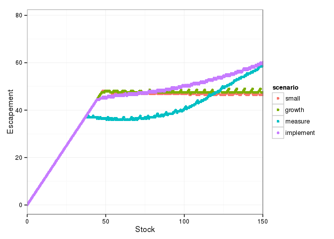

    library("dplyr")

    ## 
    ## Attaching package: 'dplyr'
    ## 
    ## The following objects are masked from 'package:stats':
    ## 
    ##     filter, lag
    ## 
    ## The following objects are masked from 'package:base':
    ## 
    ##     intersect, setdiff, setequal, union

    library("tidyr")
    library("ggplot2")
    library("multipleuncertainty")

    grid <- seq(0, 200, length = 401)
    small     <- multiple_uncertainty(f = logistic, x_grid = grid, sigma_g = 0.1, sigma_m = 0.1, sigma_i = 0.1)
    growth    <- multiple_uncertainty(f = logistic, x_grid = grid, sigma_g = 0.5, sigma_m = 0.1, sigma_i = 0.1)
    measure   <- multiple_uncertainty(f = logistic, x_grid = grid, sigma_g = 0.1, sigma_m = 0.5, sigma_i = 0.1)
    implement <- multiple_uncertainty(f = logistic, x_grid = grid, sigma_g = 0.1, sigma_m = 0.1, sigma_i = 0.5)
    df <- data.frame(y_grid = grid, small = small, growth = growth, 
                       measure = measure, implement = implement) %>%
        tidyr::gather(scenario, value, -y_grid)

    df %>% 
      ggplot(aes(x = y_grid, y = value, col = scenario)) + 
        geom_point()  + 
        xlab("Stock") + ylab("Escapement") + 
        coord_cartesian(xlim = c(0, 100)) + 
        theme_bw()

