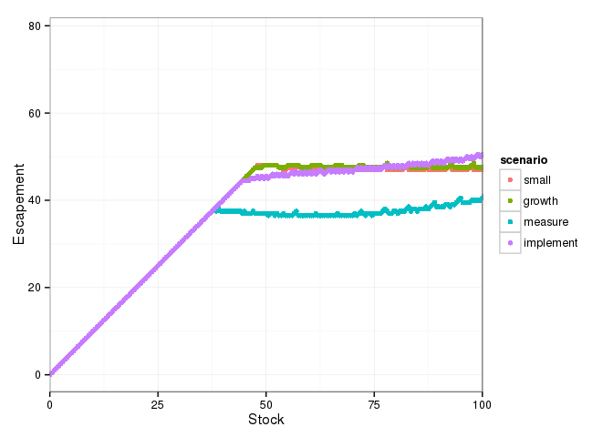

``` r
library("dplyr")
library("tidyr")
library("ggplot2")
library("multipleuncertainty")
```

``` r
grid <- seq(0, 200, length = 401)
small     <- multiple_uncertainty(f = logistic, x_grid = grid, sigma_g = 0.1, sigma_m = 0.1, sigma_i = 0.1, noise_dist = "uniform")
growth    <- multiple_uncertainty(f = logistic, x_grid = grid, sigma_g = 0.5, sigma_m = 0.1, sigma_i = 0.1, noise_dist = "uniform")
measure   <- multiple_uncertainty(f = logistic, x_grid = grid, sigma_g = 0.1, sigma_m = 0.5, sigma_i = 0.1, noise_dist = "uniform")
implement <- multiple_uncertainty(f = logistic, x_grid = grid, sigma_g = 0.1, sigma_m = 0.1, sigma_i = 0.5, noise_dist = "uniform")
df <- data.frame(y_grid = grid, small = small, growth = growth, 
                   measure = measure, implement = implement) %>%
    tidyr::gather(scenario, value, -y_grid)
```

``` r
df %>% 
  ggplot(aes(x = y_grid, y = value, col = scenario)) + 
    geom_point()  + 
    xlab("Stock") + ylab("Escapement") + 
    coord_cartesian(xlim = c(0, 100)) + 
    theme_bw()
```


