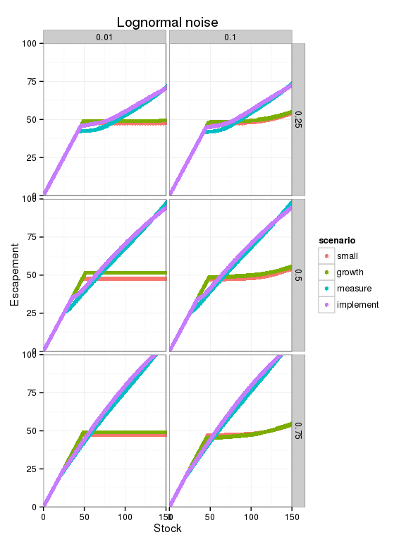

``` r
library("dplyr")
library("tidyr")
library("ggplot2")
library("multipleuncertainty")
knitr::opts_chunk$set(cache = TRUE)
```

Optimal control under multiple uncertainty by model:

``` r
noise_dist = "lognormal"
model = "logistic"

fig3 <- function(low, high){  
  grid <- seq(0, 200, length = 401)
  model <- get(as.character(model))
  small     <- multiple_uncertainty(f = model, x_grid = grid, sigma_g = low, sigma_m = low, sigma_i = low, noise_dist = noise_dist)
  growth    <- multiple_uncertainty(f = model, x_grid = grid, sigma_g = high, sigma_m = low, sigma_i = low, noise_dist = noise_dist)
  measure   <- multiple_uncertainty(f = model, x_grid = grid, sigma_g = low, sigma_m = high, sigma_i = low, noise_dist = noise_dist)
  implement <- multiple_uncertainty(f = model, x_grid = grid, sigma_g = low, sigma_m = low, sigma_i = high, noise_dist = noise_dist)
  ## Combine records by scenario
  df <- data.frame(y_grid = grid, small = small, growth = growth, 
                   measure = measure, implement = implement) %>%
    tidyr::gather(scenario, value, -y_grid)
}
```

``` r
expand.grid(low = c(0.01, 0.1), high = c(0.25, 0.5, 0.75) ) %>%
  dplyr::group_by(low, high) %>%
  dplyr::do(fig3(.$low, .$high)) -> df
```

``` r
df %>%
  ggplot(aes(x = y_grid, y = value, col = scenario)) + 
    geom_point()  + 
    facet_grid(high ~ low) + 
    xlab("Stock") + 
    ylab("Escapement") + 
    coord_cartesian(xlim = c(0, 150), ylim = c(0,100)) + 
    theme_bw()
```


