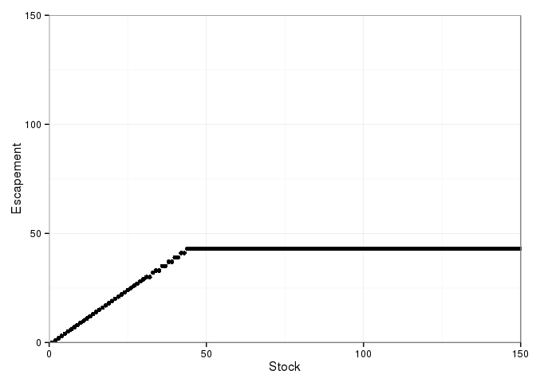

---
author: Carl Boettiger
date: '9/24/2015'
output:
  md_document:
    variant: markdown
title: Fig3 robustness to grid
...

``` {.r}
library("dplyr")
library("tidyr")
library("ggplot2")
library("multipleuncertainty")
```

``` {.r}
reed <- multiple_uncertainty()

qplot(seq_along(reed), reed) + 
    coord_cartesian(xlim = c(0, 150), ylim = c(0, 150)) + 
    xlab("Stock") + ylab("Escapement") +
    theme_bw()
```


