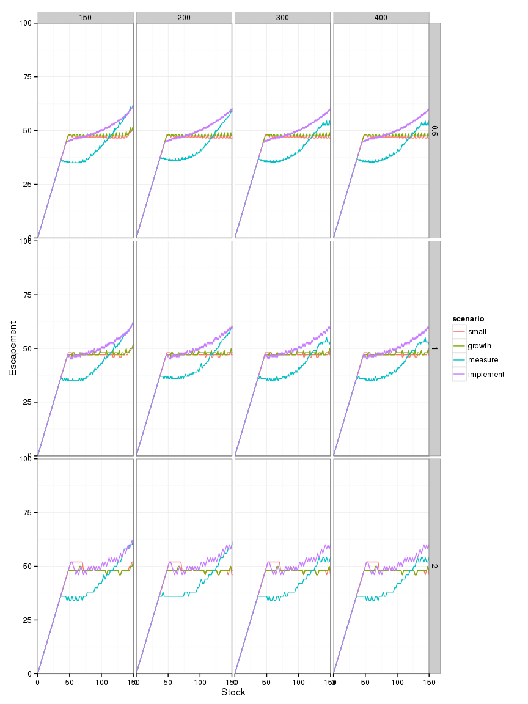

``` r
library("dplyr")
```

    ## 
    ## Attaching package: 'dplyr'
    ## 
    ## The following objects are masked from 'package:stats':
    ## 
    ##     filter, lag
    ## 
    ## The following objects are masked from 'package:base':
    ## 
    ##     intersect, setdiff, setequal, union

``` r
library("tidyr")
library("ggplot2")
library("multipleuncertainty")
knitr::opts_chunk$set(cache = TRUE)
```

``` r
fig3 <- function(m, l){  
  grid <- seq(0, m, length = l)
  small     <- multiple_uncertainty(f = logistic, x_grid = grid, sigma_g = 0.1, sigma_m = 0.1, sigma_i = 0.1)
  growth    <- multiple_uncertainty(f = logistic, x_grid = grid, sigma_g = 0.5, sigma_m = 0.1, sigma_i = 0.1)
  measure   <- multiple_uncertainty(f = logistic, x_grid = grid, sigma_g = 0.1, sigma_m = 0.5, sigma_i = 0.1)
  implement <- multiple_uncertainty(f = logistic, x_grid = grid, sigma_g = 0.1, sigma_m = 0.1, sigma_i = 0.5)
  df <- data.frame(y_grid = grid, small = small, growth = growth, 
                   measure = measure, implement = implement) %>%
    tidyr::gather(scenario, value, -y_grid)
}

df <- 
data.frame(id = 1:5, 
           max    = c(150, 200, 200, 400, 150), 
           length = c(151, 201, 401, 401, 451)) %>%
  dplyr::group_by(id) %>%
  dplyr::do(fig3(.$max, .$length))
```

``` r
df %>%
  ggplot(aes(x = y_grid, y = value, col = scenario)) + 
    geom_point()  + facet_wrap(~id, ncol = 2) + 
    xlab("Stock") + ylab("Escapement") + 
    coord_cartesian(xlim = c(0, 150), ylim = c(0,100)) + 
    theme_bw() 
```


