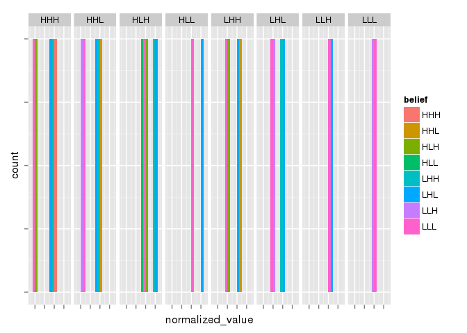

``` r
library("stringr")
library("dplyr")
library("tidyr")
library("ggplot2")
library("lazyeval")
library("readr")
library("multipleuncertainty")
knitr::opts_chunk$set(cache = TRUE, comment=NA)
```

Optimal control under multiple uncertainty by model:

``` r
mean_value <- function(sigma_g_belief, sigma_m_belief, sigma_i_belief,
                     sigma_g_true, sigma_m_true, sigma_i_true){
  
  delta <- 0.05
  grid <- seq(0,150,length=151) #seq(0, 200, length = 401)
  
  S <- multiple_uncertainty(f = "logistic", 
                            x_grid = grid, 
                            sigma_g = sigma_g_belief, 
                            sigma_m = sigma_m_belief, 
                            sigma_i = sigma_i_belief,
                            delta = delta,
                            noise_dist = "uniform")

  ## Function to compute to do a replicate simulation and return NPV
  replicates <- function(){
    sim <- scenario(S, f = "logistic", 
                    x_grid = grid, 
                    sigma_g = sigma_g_true, 
                    sigma_m = sigma_m_true, 
                    sigma_i = sigma_i_true, 
                    noise_dist = "uniform")
    sim %>% 
      mutate(value = h * (1-delta) ^ t) %>% 
      summarise(NPV = sum(value))
  }
  
  ## Simulate 100 replicates of the policy and return E(NPV)
  data.frame(rep = 1:100) %>% 
    group_by(rep) %>% 
    do(replicates()) %>% 
    ungroup() %>%
    summarise(ENPV = mean(NPV), sd = sd(NPV), min=min(NPV), max=max(NPV))


  }
```

``` r
low <- 0.1
high <- 0.5
cases <-
  expand.grid(
  sigma_g_belief = c(low, high),
  sigma_m_belief = c(low, high),
  sigma_i_belief = c(low, high),
  sigma_g_true = c(low, high),
  sigma_m_true = c(low, high),
  sigma_i_true = c(low, high)
  )

group_by_all <- function(x,...) x %>%  group_by_(.dots = lapply(names(x), as.name))  
cases %>%
  group_by_all() %>%
  do(mean_value(.$sigma_g_belief, .$sigma_m_belief, .$sigma_i_belief,
                 .$sigma_g_true, .$sigma_m_true, .$sigma_i_true)) %>% 
  ungroup() -> df
```

We want to collapse the columns that simply list the values of each true/belief sigma value into a single scenario key, where we'll use `L` for "Low" noise and `H` for high. We indicate the belief values of growth, measurement, and implementation error, respectively, followed by the true values used for the simulations. Thus `HLL | LHL` indicates that the optimal solution was computing assuming high growth error, but low measurement and implementation, and then this policy was applied to simulations in which growth noise and implementation noise were low, but measurement was high.

``` r
rekey <- function(str){
  str %>% 
  stringr::str_replace_all(as.character(low), "L") %>%
  stringr::str_replace_all(as.character(high), "H") %>%
  stringr::str_replace_all("_", "")
}

df %>% 
  unite_("true", names(df)[4:6]) %>% 
  mutate(true = rekey(true)) %>% 
  unite_("belief", names(df)[1:3]) %>% 
  mutate(belief = rekey(belief)) %>% 
  select(belief, true, ENPV, sd) -> 
  table

## Include unique id for binding
table <- cbind(id = 1:dim(df)[1], table)
```

In these 8 scenarios, the beliefs match the true values for each of the noise levels:

``` r
table %>% filter(belief == true) -> optimal
optimal %>% knitr::kable("pandoc")
```

|   id| belief | true |      ENPV|         sd|
|----:|:-------|:-----|---------:|----------:|
|    1| LLL    | LLL  |  396.9258|   6.530375|
|   10| LLH    | LLH  |  371.1727|   8.265367|
|   19| LHL    | LHL  |  366.8641|  10.721565|
|   28| LHH    | LHH  |  327.5487|  14.242372|
|   37| HLL    | HLL  |  161.0474|  30.687857|
|   46| HLH    | HLH  |  155.9838|  27.492843|
|   55| HHL    | HHL  |  164.2114|  28.901709|
|   64| HHH    | HHH  |  152.0555|  23.081706|

Is it worse to believe noise is present when it is absent (e.g. conservative noise model), or ingore sources of noise when they are present?

First, we'd like to normalize each case by the expected value achieved by applying the optimal control to the simulated scenario:

``` r
tbls <- lapply(optimal$true, function(x){
  expr1 <- interp(~true == x)
  expr2 <- interp(~N, N = filter_(optimal, .dots = list(expr1))[["ENPV"]])
  table %>% filter_(~true == x) %>% mutate_(.dots = setNames(list(expr2), "N"))
})
tbl <- bind_rows(tbls) %>% arrange(id)
```

Now we can normalize for the final table:

``` r
tbl %>% mutate(normalized_value = ENPV / N) -> tbl
```

### Summarizing and Analyzing the table

Ignoring uncertaines that are present:

``` r
tbl %>% filter(belief == "HLL", true %in% c("HHL", "HLH", "HHH")) %>% knitr::kable("pandoc")
```

|   id| belief | true |       ENPV|        sd|         N|  normalized\_value|
|----:|:-------|:-----|----------:|---------:|---------:|------------------:|
|   38| HLL    | HLH  |  145.42216|  27.29802|  155.9838|          0.9322901|
|   39| HLL    | HHL  |  108.43488|  26.83073|  164.2114|          0.6603372|
|   40| HLL    | HHH  |   90.63248|  24.87252|  152.0555|          0.5960488|

Conservative: include uncertainty that doesn't exist

``` r
tbl %>% filter(true == "HLL", belief %in% c("HHL", "HLH", "HHH")) %>% knitr::kable("pandoc")
```

|   id| belief | true |      ENPV|        sd|         N|  normalized\_value|
|----:|:-------|:-----|---------:|---------:|---------:|------------------:|
|   45| HLH    | HLL  |  166.7742|  24.87790|  161.0474|           1.035560|
|   53| HHL    | HLL  |  200.1233|  28.39223|  161.0474|           1.242636|
|   61| HHH    | HLL  |  198.5589|  23.18692|  161.0474|           1.232922|

We can visualize the whole table (rows are the true scenario, columns are believed scenario). First we just plot ENPV, which justifies our normalization routine, since we see the very strong influence of reality regardless what you believe. Note that we supress grid labels as the units are arbitrary and only relative differences are of interest.

``` r
ggplot(tbl) + geom_histogram(aes(ENPV), binwidth=50) + 
  facet_grid(belief ~ true) + 
  theme(axis.text=element_blank())
```


After normalizing by the optimum that could be achieved for the given scenario, we have the following patterns.

``` r
ggplot(tbl) + geom_histogram(aes(normalized_value), binwidth=.05) + 
  facet_grid(belief ~ true)  + 
  theme(axis.text.y=element_blank()) + 
  scale_x_continuous(breaks=scales::pretty_breaks(n=4))
```


Note that some scenarios are doing better than optimal

``` r
 tbl %>% filter(belief %in% c("HHH", "HHL"), true == "LHH")
```

    Source: local data frame [2 x 7]

         id belief  true     ENPV       sd        N normalized_value
      (int)  (chr) (chr)    (dbl)    (dbl)    (dbl)            (dbl)
    1    52    HHL   LHH 344.5393 14.62523 327.5487         1.051872
    2    60    HHH   LHH 334.2415 13.41355 327.5487         1.020433

These are all scenarios in which the 'optimal' solution still scores rather poorly (see `ENPV`).

``` r
ggplot(tbl) + 
  geom_histogram(aes(normalized_value, fill=belief), position="identity", binwidth=.05) + 
  facet_grid(~ true) + 
  theme(axis.text=element_blank())
```


